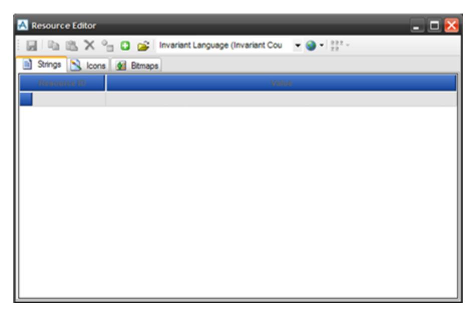
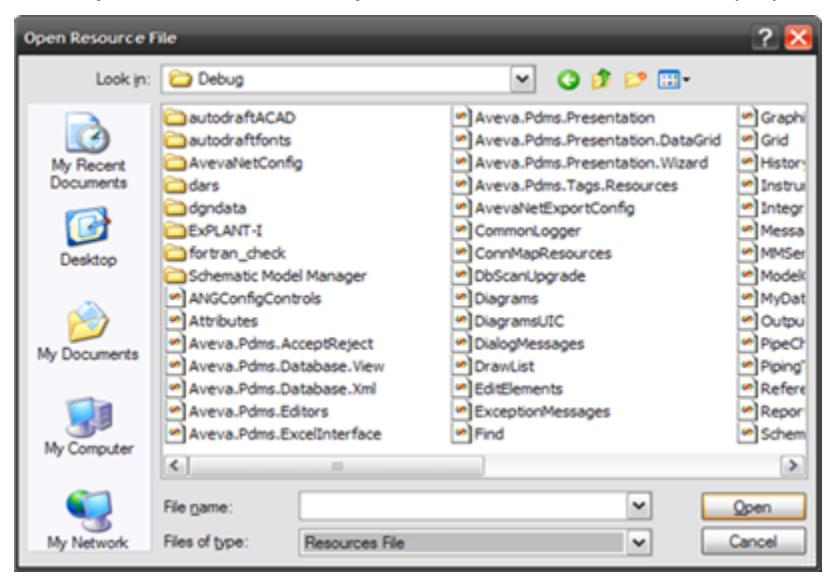
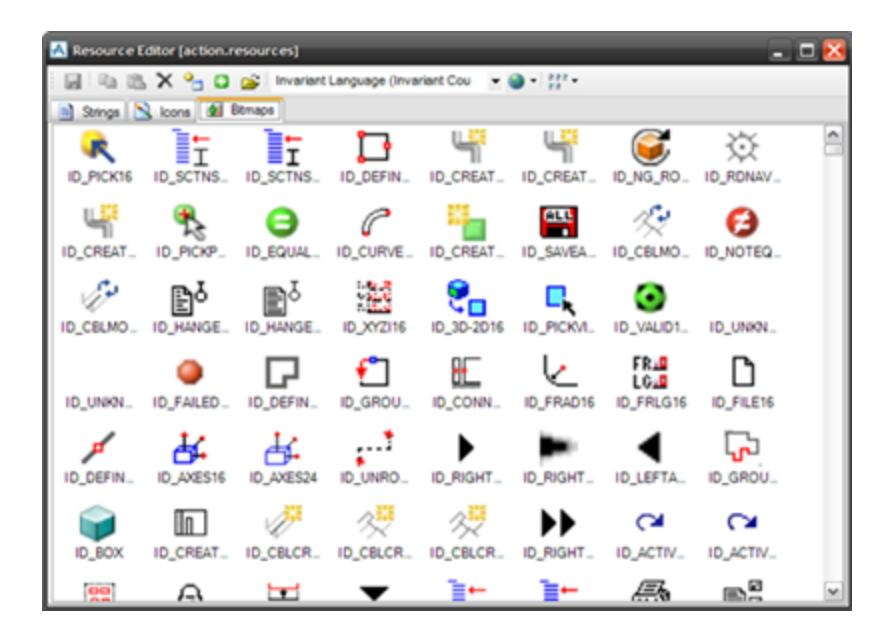
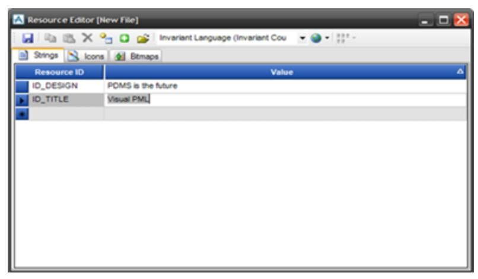
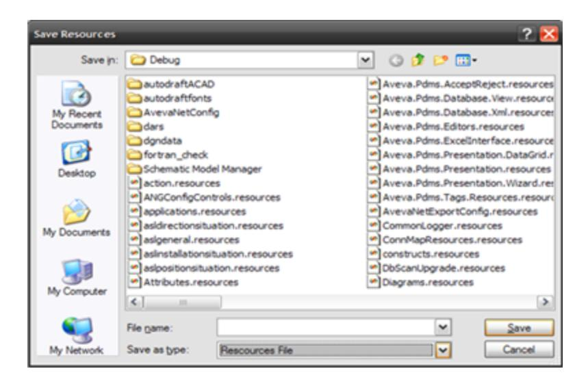

# Forms

Before reading this section, you should have read the Form Concepts section.

# Modules and Applications

An AVEVA E3D GUI module consists of a set of co-operating applications running within the Application Window. There are two types of GUI module in AVEVA E3D. Some modules have PML menus with a main menu bar and a set of toolbars, and others have tabbed (ribbon) menus, with no toolbars.

#### Each module has:

- A Main form to present the default application and to control access to the other applications.
- One or more document forms usually displaying the application model.
- Transient floating dialog forms that relate to specific tasks.
- Docking dialog forms to provide frequently required services.

## **For Modules with PML Menus and Toolbars**

The Main form has a **menu bar** that provides access to all the functionality of the current application of the module, from its pull-down menus (the *main* menu system), and a set of **toolbars**, each containing gadgets (usually icon buttons, icon toggles and pull-down lists) designed to give fast access to frequently used functions.

#### Form Attributes

For modules with tabbed menus the main form has a series of tabs that provide access to all of the functions in the module. Some tabs are shown only when certain applications or utilities have been selected by you.

## **Application Window**

The **Application Window** (AppWin) normally occupies most of the screen. When a Main form is assigned to it, the AppWin's components are replaced by corresponding components of the Main form.

From top to bottom the AppWin comprises:

- Either a tabbed menu and a quick access menu in the new modules, or a main menu bar and toolbars in modules with PML menus.
- The Document Area, which contains one or more document forms, which are normally constrained to this area.
- The Status Bar, which displays current status, messages and general information to you.

The application window is defined by the WSETUP command:

```
setup appwin title 'PDMS' size 0.8 1 at xr0.2 yr0
```

The size and position are in normalized screen co-ordinates, which range from 0.0 to 1.0 along each screen axis, which the origin at the lop left-hand corner.

#### **Current Document**

#### Form Type

# Defining a Form

The structure of a form definition file has already been discussed in [Form Definition File.](#page--1-0) The form definition is a command sequence starting with:

```
layout form !!formnameand ending with:exit
```


The sequence includes:

- The commands which create the form itself and set its attributes, such as its minimum size and title.
- The commands which create the gadgets on the form, and specify how they are arranged.
- The definitions of any variables which are to be members of the form.

#### **Form Attributes**

All the form attributes are optional and have sensible defaults. Those which can only be set once must be specified on the layout form line. These are:

- Form type
- Layout mode
- Minimum size
- Resize
- Docking
- Form position
- NOQUIT
- AUTOALIGN and NOALIGN
- NOPADDING

Other attributes are specified as sub-commands in the layout form . . . exit sequence. They can be edited after the form has been created by means of the form's in-built members and methods.

#### **Form Type**

The appearance and behavior of a form is determined by its Type attribute:


| Type of Form   | Description                                                                                                                                                                                                                                                                                                                                                                                                                                                                                                                                                                                                                                                                                                                                     |
| -------------- | ----------------------------------------------------------------------------------------------------------------------------------------------------------------------------------------------------------------------------------------------------------------------------------------------------------------------------------------------------------------------------------------------------------------------------------------------------------------------------------------------------------------------------------------------------------------------------------------------------------------------------------------------------------------------------------------------------------------------------------------------- |
| MAIN           | The form that will be swapped to as a Main form.`<br>`These forms are not usually displayed directly, but`<br>`serve to provide gadgets for the application's toolbar`<br>`and menus for the application's main menus.                                                                                                                                                                                                                                                                                                                                                                                                                                                                                                                    |
| DOCUMENT       | Resizable form usually with a view gadget, but no`<br>`menu bar. All document forms can be floated or un-`<br>`floated using the right-mouse pop-up menu in the`<br>`form's top border.`<br>`When it is floating, you can drag the form away from`<br>`the MDI frame and position it and resize it without`<br>`constraint.`<br>`This allows you to drag the document form away to`<br>`another screen of a multi-screen configuration.                                                                                                                                                                                                                                                                                         |
| DIALOG         | This is the default type the form will assume if you`<br>`gives no type when you set up the form.`<br>`The default DIALOG form will be non-resizable,`<br>`floating, and non-docking. You can specify the`<br>`DOCKING attribute to allow the form to be docked`<br>`within the application frame.`<br>`By default, a docking dialog is displayed floating, and`<br>`you can interactively dock it. When a dialog is docked`<br>`it will be resized to match the application frame edge`<br>`to which it is docked, and so is resizable by default.`<br>`The qualifiers LEFT, RIGHT, TOP, and BOTTOM, specify`<br>`the edge of the application frame to which the dialog`<br>`form will be docked when first displayed. |
| BLOCKINGDIALOG | Normal form layout and content, but will block access`<br>`to all other forms while it is displayed.                                                                                                                                                                                                                                                                                                                                                                                                                                                                                                                                                                                                                                          |

### Layout Modes

| Setup Code                            | Description                              |
| ------------------------------------- | ---------------------------------------- |
| layout form !!myform dialog dock left | Creates a resizable docking dialog;      |
| layout form !!myform dialog resizable | Creates a resizable floating dialog;     |
| layout form !!myform dialog           | Creates a non-resizable floating dialog; |

| Setup Code                          | Description                                    |
| ----------------------------------- | ---------------------------------------------- |
| layout form !!myform                | Creates a non-resizable floating dialog;       |
| layout form !!myform document       | Creates a resizable MDI child document;        |
| layout form !!myform document Float | Creates a floating resizable non-MDI document. |

### **Layout Modes**

Two layout modes are supported, namely VarChars and FixChars.

### Form and Frame Padding Control

FixChars is the old layout mode retained for backwards compatibility with older PML applications, which is based on the use of **notional character width** to calculate the approximate sizes of textual gadgets and gadget tags.

FixChars is implicit when you use 'setup form' unless you override the keyword by including the VarChars keyword or by redefining the default layout mode using !!FMSYS.SetDefaultFormLayout ( 'VarChars').

## Gadget Alignment Control

A form will automatically stretch to fit the gadgets added to it.

You can use the SIZE keyword to give a minimum size in multiples of the **character width** and **line height**. For example:

layout form !!New1 size 25.5 10

- **Character width** is the notional character width for the selected character font.
- **Line height** is the height of the tallest single line gadget, that is a TOGGLE, BUTTON, RADIO BUTTON, OPTION gadget or single-line PARAGRAPH for the selected character font.

The RESIZABLE command means that the form will be displayed with re-sizing controls at its corners. This will allow you to change the size of the form. Docking forms and all document forms are resizable by default; but for other types, if you do not include the RESIZABLE command, the size of the form is fixed.

```
layout form !!New1 RESIZABLE 
layout form !!New2 size 25 10 RESIZABLE
```

#### **Intelligent Resizable Forms**

Most gadgets have the ANCHOR attribute and a few have the DOCK attribute which allow the user to define gadgets that have intelligent positioning and resizing behavior when their container gadget resizes.

This allows you to have more than one resizable gadget on a form and still have predictable and potentially


complex resize behavior. An example of an intelligent resizable form is given in [Complex Form Layout.](#page--1-2)

However, the DOCK and ANCHOR attributes are mutually exclusive: setting the DOCK attribute resets the ANCHOR to the default; setting the ANCHOR attribute resets DOCK to none.

ALPHA and VIEW gadgets do not support DOCK or ANCHOR attributes. They do, however, expand to fill their containers, so you can put them in a frame and set the frame's DOCK or ANCHOR attributes to get the behavior you want.

### **Form and Frame Padding Control**

Normally there is some padding space inserted around the edges of the layout area for the form and any frame gadgets. This makes sure that any gadgets added do not directly abut to the frame edge for good aesthetic and readability.

The NOPADDING keyword removes this padding space so that the contents completely fills the frame.

## **Gadget Alignment Control**

You should use AutoPlacement, using Path, Dist, and Align commands for laying out forms. For further information, refer to [Form Layout](#page--1-1).

However, certain gadgets, known as the **linear gadgets**, can have their centers auto-aligned approximately to aid simple layout without you having to know about AutoPlacement concepts.

This pseudo-alignment can give sensible layout for very simple forms, but introduces small errors in all other circumstances and prevents accurate controlled layout because you do not know the offsets applied, so this is not recommended.

The default for 'layout form' is NoAlign, but for 'layout form' it is AutoAlign.

NOALIGN allows you to switch off this pseudo-alignment, and AUTOALIGN allows you to switch it on.

## Form Members

Describes the form members functionality.

## Form Title and Icon Title

The title sub-command is used to supply a string that is displayed in its banner at the top of the form's window. To set the title:

```
title 'Quite a Long Title for a Form'
```

You can modify the title at any time using the FormTitle member:

```
!!MyForm.FormTitle = 'Modified Title'
```

The icontitle sub-command is used to supply a string that is used when a form is iconized. To set the icon title:

```
icontitle 'Short Title'
```

You can also modify the icon title at any time using the **IconTitle** member:

```
!!MyForm.IconTitle = 'New Icon'
```

Form Initialization Callback

The **initialization callback** of the form allows the form's gadgets to be initialized every time it is shown to reflect the current state of the application and possibly to validate whether the form can be displayed in the current context.

The callback will usually be a reference to a form method or possibly an open callback where several forms share a Global initialization function. For further information, refer to [PML Open Callbacks](#page--1-3).

You can set the callback by assigning to the form's **initcall** member. This can be done with the INITCALL command:

```
INITCALL '!This.InitCallBack()' 
or directly by 
   !!MyForm.initcall = 'This.InitCallBack()'
```

#### Note:

The form initialization callback must not attempt to display another form. You may invoke an ALERT object but not otherwise seek any input from you.

If the callback discovers an error so serious that the form cannot be displayed it can abort the display of the form by returning an error. You can supply the text of an error message that is to be presented in an error alert in place of the form:

```
define method .initcallback() 
 : 
 return error 1 'You do not have write access to this database' 
endmethod
```

If the initialization callback has already caused an alert to be raised then you can prevent the raising of a new error alert by using the NOALERT keyword:

```
define method .initcallback() 
 : 
 return error 1 NOALERT 
endmethod
```

#### Form OK and CANCEL Callbacks

The form supports the concepts of OK and CANCEL actions:

The OKCALL callback is executed when a form's **OK** button is pressed or when the **OK** button of a form's ancestor has been pressed. For further information, refer to [Free Forms and Form Families](#page-13-0).

It allows operators to approve the current gadget settings and carry out the function of the form. The form is then removed from the screen. Typically this callback will gather all the data from the form's gadgets and perform the form's major task. If you do anything of significance in callbacks on other gadgets, you may have a hard time undoing everything if you press the **CANCEL** button.

You can assign to the form's OKCALL member using the command:

```
OKCALL 'CallbackString'
```

You can modify the Okcallback at any time using:

```
!this.Okcall = 'CallbackString'
```

The CANCELCALL callback is executed when a form's **CANCEL** button is pressed, when the **CANCEL** button of a form's ancestor is pressed (see section on Form Families), or when the window's CLOSE gadget is used. It allows the operator not to proceed with the functions of the form.

The form is then removed from the screen and all gadgets are automatically reset to the values they had when the form was displayed, or when any **APPLY** button was last pressed. Typically this callback allows you, the PML programmer, to undo any actions already carried out on the form that ought to be undone in the light of the CANCEL request.

You can assign to the form's CANCELCALL member using the command:

```
CANCELCALL 'CallbackString'
```

You can modify the CANCELcallback at any time using:

```
!this.Cancelcall = 'CallbackString'
```

For further information, refer to [Button Gadgets](#page--1-4).

## Quit/Close Callback

All Forms have a QUITCALL member that you can pass a standard callback string. This is executed whenever you press the **Quit/Close** icon (X) on the title bar of forms and the main application window.

If an open callback is used then it is called with the FORM object as its first parameter and 'QUIT' as its action string.

#### QUITCALL for MAIN Forms

For forms of type MAIN, the QUITCALL callback is executed, if present. This permits you to terminate the application, and so the associated PML callback should prompt you for confirmation.

If you confirm the quit, then the callback should close down the application, and *not* return. If you decide not to quit, then the callback should return an error to indicate the decision to F&M.

Use return error... noalert if you want to avoid displaying an error alert. If the form has no QUIT callback, then the QUIT event will be ignored.

The following example shows a (Global) PML function, that could be use from all forms of type MAIN:

```
define function !!quitMain( ) 
 -- Sharable method Quit the application 
 !str = !!Alert.Confirm('Are you sure you want to quit the application?') 
 if( !str eq 'YES' ) then 
  -- execute application termination command, which should not return 
  finish 
 else 
  return error 3 |user chose not to QUIT| noalert 
 endif 
endfunction
```

This would be called from the form definition function body or from its constructor method as shown below:

```
Layout form !!myApplication MAIN 
 . . . 
 quitCall '!!quitMain( )' 
 . . . 
exit 
define method .myApplication( ) 
 -- Constructor 
 !this.quitCall = '!!quitMain( )' 
 . . . 
endmethod
```

QUITCALL for Other Forms

Essentially, if no QUIT callback is present, then the form is cancelled (hidden with reset of gadget values). If a QUIT callback is provided then you can prevent the default Cancel action by returning a PML error, but you must hide the form from their callback method (It is more efficient the use '!this.hide()', rather than 'hide !!myform' from your form methods).

#### Note:

F&M does not display an alert for the returned error, it is merely for communication. You do not need a QUIT callback if you just want to allow the form to be hidden. For DOCUMENT forms (MDI children) only, the callback *must not display an alert* as this will cause some gadgets to malfunction afterwards.

### FIRSTSHOWN callback

Typically assigned in the Constructor by:

```
!this.FirstShownCall = '!this.<form_method>'
```

The purpose is to allow you to carry out any form actions which can only be completed when the form is actually displayed. There are a variety of circumstances where this arises and it is often difficult to find a reliable solution. A couple of examples are given below.

Commands which manipulate form, menu, or gadget visual properties, executed from a PML macro, function or callback may not happen until control is returned to the window manager's event loop.

For example, in the application's start-up macro, the command sequence show !!myForm ... hide !!myform will result in the form not being displayed, but also not becoming known at all to the window manager. Attempts to communicate with this form via the External callback mechanism (possibly from another process) will not work. This can be rectified by doing the '!this.hide()' within the FIRSTSHOWN callback, because the form will be guaranteed to be actually displayed (and hence known to the window manager), before it is hidden.

It is sometimes difficult to achieve the correct gadget background color setting the first time the form is displayed. This can be resolved by setting the required color in the FIRSTSHOWN callback.

## KILLING callback

Typically assigned in the Constructor by:

```
!this.KillingCall = '!this.<form_method>'
```

The purpose is to notify the form that it is being destroyed and allow the assigned callback method to destroy any associated resources, for example, Global PML objects which would otherwise not be destroyed. This may be necessary because PML Global objects will survive an application module switch, but may not be valid in the new module.

#### Note:

The callback method *must not* carry out any modifications to the Gadgets belonging to the form or to the Form itself (for example, do not show or hide the form). Attempts to edit the form or its gadgets may cause unwanted side effects or possible system errors.

#### Note:

Form callbacks designed for other Form events (CANCEL, INIT) are rarely suitable as killing callbacks. Restrict form and gadget operations to querying.

Form Variables: PML Variables within a Form

It is often convenient to store additional information on a form which will not be displayed to you. This is achieved by defining **form variables**.

These are variables which can be any of the PML data types, including ARRAYS and OBJECTS. These variables have the same lifetime as the form and are deleted when the form itself is killed.

Form members are defined in just the same way as object members:

```
layout form !!MyForm... 
 : 
 member .MyNumber is REAL 
 member .MyString is STRING 
 member .MyArray is ARRAY 
 : 
exit
```

The value of a form member can be set and used in just the same way as an object member:

```
!!MyForm.MyNumber = 42 
!Text = !This.MyNumber 
!ThirdValue = !This.MyArray[3]
```

In a callback function you can use !this. to represent 'this form':

```
!ThirdValue = !This.MyArray[3]
```

### Form Opacity

The opacity property of the form allows the percentage opaqueness (lack of transparency) for a form to be specified and queried. The opacity is specified as a real number in the range 10% (very transparent) to 100% (not transparent), for example:

```
!!myform.opacity = 30 
q var !!myform.opacity 
<REAL> 30
```

### Querying Form Members

You can query the members of a form using the command:

```
q var !!formname
```

This will list all the attributes of the form, and all the gadgets defined on it. This is a useful debugging aid.

To query all the gadgets of a form (excludes USERDATA gadget) use:

```
!!gadgetsarray = !!MyForm.gadgets()
```

Returns array of GADGET.

## Icons from Resource Files

During form definition, where the form gadgets and members are being defined, icons can easily be added to the form.

Just after pixmap, the string Shared>ID\_BACK specifies the resource file to look into for the relevant image file in this case ID\_BACK. The special character (>) is important in this case to separate the resource file from the

#### resource key.

Outside of the form setup, that is in the form methods, icons can also be set at this point using addPixmap with takes one parameter in single quote as shown:

In the event that a resource file or key cannot be located, an error message is shown.

### Editing an Existing Resources or Resx file

Resources files are stored in the AVEVA E3D executable directory. Once the ResourceEditor.exe has loaded in the AVEVA E3D executable directory, locate the ResourceEditor.exe file and double-click on it. When the Resource Editor loads, most controls will be disabled, only **Add New .RESOURCES File** and **Open a File** should be enabled.




Click **Open a File**, then the **Open Resource File** window is displayed.



Select the required file, then click **Open**, so that the **Resource Editor [action.resources]** window is displayed.

From the **Resource Editor [action.resources]** window, edit as required. For example, add strings, icons or bitmaps images, for PML forms and menu, use bitmaps saved as PNG images.



## Create a New Resource File

A completely new resources file can be added to the AVEVA E3D executable directory and used straightaway, this is only possible if the directory is not write protected. To do this, click **Add New . RESOURCES File**.

A **Resource Editor [New File]** window is displayed, a blank file with some controls enabled is displayed, strings or images can then be added.



Click **Save**, so the **Save Resources** window is displayed. By default, you are prompted to save in the start-up directory, which is the AVEVA E3D executable directory. If this is not the case, save to the AVEVA E3D installation directory.



# Loading, Showing, and Hiding Forms

Describes the loading, showing, and hiding forms functionality.

`<span id="page-13-0">`

## Free Forms and Form Families

Forms are displayed on the screen either as **free-standing forms** or as a **member of a form family**.

A form can be displayed as a free standing form, for example by show !!form free. It then has no parent so it will not disappear when the form which caused it to be displayed is hidden.

When one form causes another form to be displayed, such as when a button with the **FORM** keyword is pressed or a gadget callback executes a show !!form command the result is a **child form**.

A form can have many child forms (and grandchildren) but a child form has only one parent - the form which caused the child form to be displayed. The nest of related forms is called a Form Family.

The Form Family exists just as long as the forms are displayed. If a form is already on the screen when it is shown, it is brought to the front of the display. If the child form is already in a Form Family it is transferred to the new parent.

If you press the **OK** button of a parent form, the system in effect presses the **OK** buttons on each of the child forms, 'youngest' first, invoking their OKCALL callbacks. The parent form and all child-forms are hidden and the Form Family then ceases to exist.

If you press the **CANCEL** button or use the window's **CLOSE** controls, the system in effect presses the **CANCEL**  buttons of each of the child forms, 'youngest' first, invoking their CANCELALL callbacks, and all the forms in the Form Family are hidden.

The action of **RESET** and **APPLY** buttons does not affect family members.

### Loading and Showing Forms

A form definition must be loaded before the form can be displayed.

If you have saved the definition in a .pmlfrm file then loading will be automatic when the form is displayed for the first time.

#### Note:

Earlier AppWare used form definitions in macro files which had to be loaded explicitly via \$m path-name. This mechanism still operates for backwards compatibility, but is strongly discouraged when writing new AppWare.

Normally, a form is displayed as a result of the operator making a menu selection or pressing a button on a form. This is achieved either by using the Form directive in the menu or button definition or by means of the command:

```
show !!formname
```

used in the gadget's callback. In either case the form becomes a child of the menu's or gadget's owning form.

A form may be displayed free-standing (not as a child) by:

```
show !!formname free
```

Sometimes it is useful to force the loading of the definition file of a form before the form is actually displayed, so that you can edit the form or gadget attributes from the callbacks of another form before the form is actually displayed. Using the command:

```
loadform !!formname
```

from a callback will force load the definition if the form is unknown to PML, but do nothing if the form has already been loaded.

If you are sure that a form's definition has been loaded then you can show the form as a child or free-standing respectively using the form methods:

```
!!formname.show( ) 
!!formname.show( 'free' )
```

Note that this will *not* dynamically load the form definition.

### Position of Forms on the Screen

Mostly forms are automatically positioned by the system according to their type and the way they are shown.

The **origin** of a form is its top left hand corner.

When a form is displayed as a child form then it is *always* positioned with respect to its parent.

For a form shown from a MENU, its origin is at the origin of the parent. If the form is displayed from a BUTTON or any other gadget, its origin is at the center of the gadget.

When a form is shown as a free form for the first time then its default position is at the top left-hand corner of the screen.

#### Note:

It is strongly recommended that you allow the system to position forms whenever possible.

You can force the screen position of free-standing forms using the following commands or methods:

```
show !!MyForm Free At xr 0.3 yr 0.5 
show !!MyForm Free centered xr 0.5 yr 0.5 
!!MyForm.show( 'At', 0.3, 0.5 ) 
!!MyForm.show( 'Cen', 0.5, 0.5 )
```

The At option puts the origin of the form at the specified position; alternatively the Cen option puts the center of the form at the given position. The co-ordinate values are fractions of the screen width or height respectively and are referred to as **screen co-ordinates**.

For example:

```
show !!MyForm free At xr 0.25 yr 0.1
```

This positions the origin of !!MyForm one quarter of the way across from the left edge of the screen, and one-

tenth of the way down from the top.

```
!!MyForm.show( 'Cen', 0.5, 0.5 )
```

This centers !!MyForm at the middle of the screen.

### Hiding Forms

The recommended way for a form to be removed from the screen is for you to press a button with the OK or CANCEL attribute.

Forms may also be cancelled by using the **close controls** of the window. Both of these mechanisms will remove the form and any of its children executing their OK or CANCEL callbacks appropriately.

Sometimes it is required to hide a form and other forms which are functionally associated but not part of the form family or as a result of a button press on a form you may want to hide other associated forms but not the form whose button was pressed. The hide command or method allows this:

```
hide !!MyForm 
!!MyForm.hide()
```

#### Note:

When you explicitly hide a form in this way its gadgets will be reset to their values at display or at the last APPLY, just like a CANCEL action, but the CANCELCALL callbacks for the form and its nest will not be applied. This means that before you execute the hide you should use any pertinent data from the forms to be hidden.

### Killing Forms

You can destroy a loaded form definition using the command:

```
kill !!MyForm
```

The form is hidden and then its definition is destroyed so that it is then no longer known to PML. You cannot then access the form or its gadgets, members or methods (including its .show() method).

#### Note:

Normally you will not need to include the kill command within their AppWare.

If you re-show the form using the show command then the system will attempt to demand load the definition again. This is slow and expensive if you have not modified the definition so avoid it and use loadform !!MyForm and !!MyForm.show() instead.

If you execute a layout form !!MyForm... while the form !!MyForm already exists, then it is killed and a new definition is started. This mechanism may be useful because it makes it possible to generate a form definition interactively from within their AppWare.

This can be very powerful but should be used with great care.

#### NOQUIT Form Status

You can stop forms from being hidden from the border close/quit pull-down menu by setting the NOQUIT attribute:

```
Layout form !!MyForm . . . NOQUIT
```

By default, you can quit from any User-defined form, except for the current system Main form.
