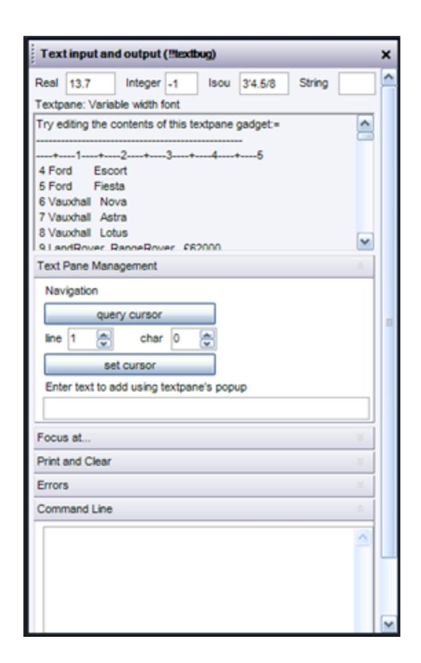

## Frame Gadgets

Frame gadgets provide visual grouping of gadgets on a form, and aid form layout.

The grouping is more than visual: a frame is a genuine container and manages the gadgets it contains, so gadgets are positioned relative to the frame's origin rather than the form's origin.

When a container resizes it will adjust the layout of all its children, taking account of their anchor or dock properties.

The frame gadget's properties visible and active will automatically apply to all of its children, but will not overwrite their corresponding property values. For example, frame .f1 contains button .b1 and f1 and b1 both have visible = true.

The command:

```
!!form.f1.visible = false
```

will cause the frame and all its contained gadgets to be hidden, but the query:

```
!value = !!form.b1.visible
```

will still return true.

### Defining a Frame

You define a frame using a command sequence beginning with the command frame and ending in exit.

All the gadgets defined after the frame command and before exit will be included in and contained by the frame.

The following example defines Frame1 and its gadget collection. The frame sub-type <frame-type> is either one of the supported types TABSET, TOOLBAR, PANEL, FOLDUPPANEL, or omitted for a normal or tabbed page frame.

```
frame .frame1 <frame-type> '<frame-tag>' 
 paragraph .Message1 text 'This frame contains toggle buttons' 
 PATH DOWN 
 toggle .Bold 'Bold' 
 PATH RIGHT 
 toggle .Italic 'Italic' 
 toggle .Underline 'Underline' 
exit
```

#### Frame Size

During form definition, once a frame is positioned on the form the origin remains fixed but the frame automatically expands downwards and to the right to contain any gadgets added to it. You can optionally declare a minimum size for the frame. For example:

```
Frame frame1 'frame 1' WIDTH ... HEIGHT...
```

#### Note:

For TOOLBAR frames, the gadgets appear as a single row in the order defined and gadget positions are ignored.

#### Frame Radio Groups

A FRAME may have a set of RTOGGLE gadgets defined directly within it which act in concert as a radio group. An example of a FRAME with a directly defined radio group looks like this:


The radio group action only applies to FRAME gadgets of type NORMAL, PANEL, FOLDUPPANEL.

You can add RTOGGLE to a FRAME with the usual positioning and layout commands.

The FRAME has a value member, VAL, which is the index of currently selected RTOGGLE for the radio group. You can use this to change the selected RTOGGLE.

Similarly, you change the value of the FRAME by setting the VAL member of any of the group's RTOGGLEs to true.

Note that the FRAME group value may be set to zero, indicating that there is no selected RTOGGLE. Similarly if the selected RTOGGLE value is set to false, then it becomes deselected and the FRAME value will then be zero.

The default value for an RTOGGLE gadget is FALSE, and the default value for a FRAME gadget is zero, i.e. no selected RTOGGLE.

#### Frame Callbacks

The FRAME gadget can have an assigned callback, which is executed when the radio group selection is changed, whenever you select an unselected radio-toggle. As there is only a SELECT action supported, it can be either a simple callback or an open callback.

The form definition below is a simple TV and radio station selector, shown above.

```
layout form !!FRGTest dialog noAlign 
  title |Select a program| 
  Frame .rg1 |TV and Radio| 
   path down 
   text .choice tagwid 6 |Selection:| width 12 is STRING 
   rToggle .rad1 tagwid 7 |BBC 1| States '' 'BBC 1' 
   path right 
   valign centre 
   rToggle .rad2 tagwid 7 |BBC 2| States '' 'BBC 2' 
   rToggle .rad3 tagwid 7 |Anglia| States '' 'Anglia' 
   rToggle .rad4 tagwid 7 |Chan 4| at xmin.rad1 ymax.rad1 States '' 'Chan 4' 
   rToggle .rad5 tagwid 7 |Radio:| States '' 'radio' 
   option .Radio width 10 
   exit 
  button .cancel |Cancel| at xmin form ymax form + 0.2 CANCEL 
  button .ok | OK | at xmax form - size OK 
 - set focus to button to ensure to ensure Windows does not set it to first Rtoggle 
 !this.keyboardFocus = !this.ok 
exit
```

#### Note:

The form's keyboard focus is initially placed on the **OK** button to prevent it being assigned (by Windows) to the first RTOGGLE rad1 (effectively the first interactive gadget on the form as the text field **Selection** is read-only).

The form constructor method assigns a simple callback, the form method RGroupSelectionChanged(), to the frame rg1 (radio group). It then initializes the gadget values and selects the second RTOGGLE as the default selection.


```
define method .FRGTest() 
 -- Constructor 
 -- Frame radiogroup with simple callback 
 !this.rg1.callback = '!this.RGroupSelectionChanged( )' 
 -- set result field read-only 
 !this.choice.setEditable(false) 
 -- Radio choices 
 !this.rad5.setTooltip(|select your Radio option|) 
 !radio[1] = 'Q103' 
 !radio[2] = 'Hereward' 
 !radio[3] = 'Cambridge' 
 !radio[4] = 'ClassicFM' 
 !radio[5] = 'Caroline' 
 !this.Radio.dtext = !radio 
 !this.Radio.setTooltip(|change your Radio option|) 
 !this.Radio.callback = '!this.selectProgram(!this.rad5)' 
 -- set initial value 
 !this.rg1.val = 2 
 !this.RGroupSelectionChanged( ) 
Endmethod
```

The group callback uses the FRAME's VAL member to get the current selected index and hence the current RTOGGLE and its OnValue member value. If the selected RTOGGLE'S value is 'radio', then the selected program is read from the RADIO option gadget. Finally the selected program string is displayed in the Selection (read-only) text gadget.

```
define method .RGroupSelectionChanged( ) 
 -- Service radiogroup select event 
 !Frame = !this.rg1 
 !index = !Frame.val 
 !rTog = !Frame.RToggle(!index) 
 !value = !rTog.onValue 
 -- Do some application actions 
 if( !value eq 'radio' ) then 
  !value = !this.Radio.selection('dtext') 
 endif 
 !this.choice.val = !value 
endmethod
```

The callback on the RADIO option gadget detects if the 'radio:' RTOGGLE rad5 is current and if so, it deselects it, leaving no current selection, and clears the **Selection** text field.

```
define method .selectProgram( !rtog is GADGET ) 
 -- Select new program from option list 
 if( !this.rg1.val eq !rtog.index ) then 
  -- rtog is current, so deselect it within group 
  !this.rg1.val = 0 
  !this.choice.clear() 
 endif 
endmethod
```

#### Managing Pages in Tabset Frames

Within a Tabset frame, whenever you interactively select a new tab a HIDDEN event is raised for the previous tabbed page frame and then a SHOWN event is raised for the new one, which pops to the front. The HIDDEN and SHOWN callbacks are only executed for tabbed page frames which provide an Open callback.


If you want to manage tabbed pages that are also radio groups, then you must supply an open callback so you can differentiate the SELECT (RTOGGLE) event and the (page) SHOWN event.

Setting a tabbed page frame's VISIBLE property, for example, !this.TabbedPage.visible = true, selects it and gives it focus, but does not raise HIDDEN or SHOWN events.

The example below shows a typical form method you could use as a PML open callback to handle frame events for any frame gadgets defined on a form:

```
define method .frameEvents(!frame is GADGET, !event is 
STRING) 
 -- Frame events open callback handler 
 if( !event eq 'SELECT' ) then 
  --Handle radio button selection 
  !selection = !frame.val 
  ... 
 elseif( !event eq 'SHOWN' ) then 
  -- tabbed page selected 
  -- modify page content 
  ... 
 endif 
endmethod
```

## Managing Fold Up Panel Frames

FoldUpPanels are provided essentially to support forms which display simple, single column, vertical frame stacks.

The form shown below is a simple resizable dialog with five FoldUpPanel frame gadgets. When first shown, the first and last are expanded and the other three are collapsed.

Each panel has a title bar which displays the frame's tag text, and an 'expander' icon on the right.

You may specify the panel's background color using the <fgcol> graph, e.g. BACKGround lightGold, backg 23, backg FORM etc.

The default state is 'unfolded' and the EXPANDED property allows you to initialize a panel to unfolded (true) or folded (false).

When the panel expands or collapses, any gadgets which lie below the panel will move down or up the form.

For simple dialogs the form will resize to create space when a FoldUpPanel is expanded, and to absorb space when it is collapsed.

For docking dialogs the form will not resize as FoldUpPanels are expanded or collapsed. Generally a scroll bar will automatically appear whenever gadgets have been moved off the bottom of the form, so that the entire form is always accessible.

Care must be exercised when mixing FoldUpPanels at the same level as other gadgets which manage their resize behavior with Anchor or Dock attributes. For example, consider a simple dialog form with a frame gadget which is anchored 'bottom' and vertically below, a FoldUpPanel. When you collapse the panel, the form will not absorb the spare height, because the distance from the frame's bottom edge to the form's bottom edge is fixed by the 'anchor', so the anchored frame has to contract instead, and spare space will appear at the bottom of the form.




### Fold Up Panel Events

HIDDEN and SHOWN events are raised whenever you interactively fold or unfold the panel. These events are only fired if an Open callback is defined for the foldup frame. To manage FoldUpPanels which are also radio groups, then you must supply an open callback so that you can differentiate the panel's SELECT, HIDDEN and SHOWN events.
